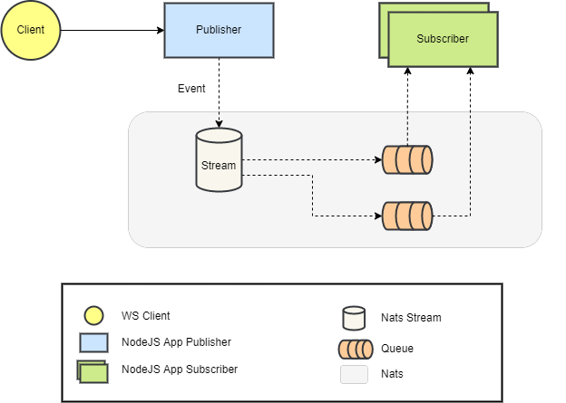

# Nats-ts-node

This project presents a practical example of the concepts of [Nats](https://nats.io/). The App Client exposes some endpoints in NodeJs + Express. During application startup, subscribers are added to queues to listen to subjects. When a client invokes the endpoints, an event is published, and Nats persist that event in a stream. Subscribers are notified about the event, process them, and acknowledge Nats about the consumed event.

Below, show the resumed architecure



## Start the environment

```sh
docker-compose up
```

This command will start the Nats Server and three NodeJS Applications. The app node1 is configurated to be only publisher, other node apps (2 and 3) are publisher and subscriber.

## The endpoints

`/goal`

HTTP return 200 OK, the subscriber will be consume the event and acknowledge.

`/goal-offside`

HTTP return 200 OK, the subscriber will be consume the event, throw an error and notify Nats with non acknowledge. The message won´t be resent.

`/goal-checking-var`

HTTP return 200 OK, the subscriber will be consume the event, and the timeout proccessing. The message will be resent. We know, VAR delayed the game excessively.

## Nats CLI

Download Nats CLI [https://github.com/nats-io/natscli/releases](https://github.com/nats-io/natscli/releases)
<br>

Connect to Nats Server

```sh
nats context add nats --server 0.0.0.0:4222 --description "NATS Docker local" --select
```

Subscribe on subject

```sh
nats sub futebol.brasileiro
```

Publish on topic

```sh
nats pub futebol.brasileiro "Bora Bahea"
```

## Nats Jetstream

Create a stream

```sh
nats stream add futebol_stream
```

Info about stream

```sh
nats stream info futebol_stream
```

Publish on a stream

```sh
nats pub brasileirao --count=1000 --sleep 1s "publication #{{Count}} @ {{TimeStamp}}"
```

Add a consumer

```sh
nats consumer add
```

Consume a message

```sh
nats consumer next futebol_stream [consumer-name] --count 1000
```

Stop container (don´t receive messages)

```sh
docker container stop
```

Start container (receive messages)

```sh

docker container start <CONTAINER-ID>
```

Remove a message

```sh
nats stream rmm
```

Stream report

```sh
nats stream report
```

Remove all messages

```sh
nats stream purge
```
